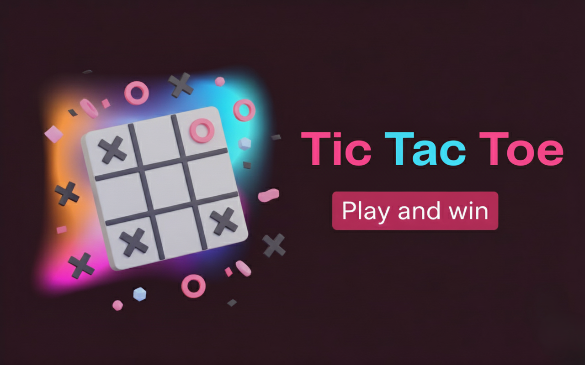
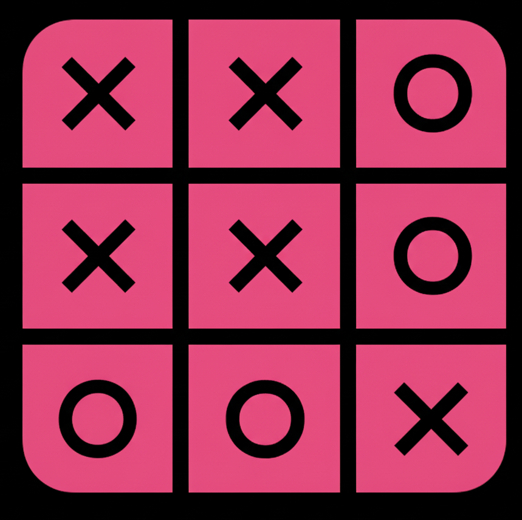

# Tic Tac Toe 🎮


---

## 🚀 Overview
**Tic Tac Toe** is a fun, interactive web-based game built using **HTML, CSS, and JavaScript**.  
Players can enter their names, play turns, and see the scoreboard update automatically. The game is responsive and works seamlessly on both desktop and mobile devices.

**🔗 Watch it Live:** [Tic Tac Toe Live Site](https://ravi-kumar-chinta.github.io/TicTacToe/)

---

## ✨ Key Features
✅ **Two Player Mode** – Play with friends on the same device.  
✅ **Score Tracking** – Keeps track of wins for both players.  
✅ **Responsive Design** – Optimized for desktop, tablet, and mobile.  
✅ **Interactive Grid** – Clickable cells with visual feedback.  
✅ **Light/Dark Mode** – Toggle between light and dark themes.  
✅ **Read-only Names During Game** – Player names cannot be edited mid-game.  

---

## 🛠️ Technologies Used
- **HTML5** – Structure and content  
- **CSS3** – Styling, layout, and responsiveness  
- **JavaScript (ES6+)** – Game logic and interactivity  
- **Images** – Icons and assets for UI  

---

## ⚙️ Installation & Setup
1. **Clone the repository:**
```bash
git clone https://github.com/ravi-kumar-chinta/TicTacToe.git
```
---

## 📂 File Structure
```bash
TicTacToe/
├── assets/
│   ├── images/
│   │   ├── banner.png       # Banner image
│   │   └── logo.png         # Logo image
├── style.css                # Styling for the game
├── script.js                # JavaScript logic
├── index.html               # Main HTML file
└── README.md                # Project documentation

```
---

## 🎮 How to Play
1. Enter names for Player X and Player O.  
2. Click on empty cells to mark X or O.  
3. The first player to align 3 marks horizontally, vertically, or diagonally wins.  
4. Check the scoreboard to see the updated scores.  
5. Use the **Restart Game** or **New Game** buttons as needed.  
---

## 🖼️ Preview
  
  

---

## ✅ Conclusion
- A simple and fun Tic Tac Toe game with real-time score tracking.  
- Built using **HTML, CSS, and JavaScript**.  
- Fully responsive and interactive for all devices.  
---
🎉 **Enjoy Playing!**  
Challenge your friends and keep track of your victories! 🏆  
